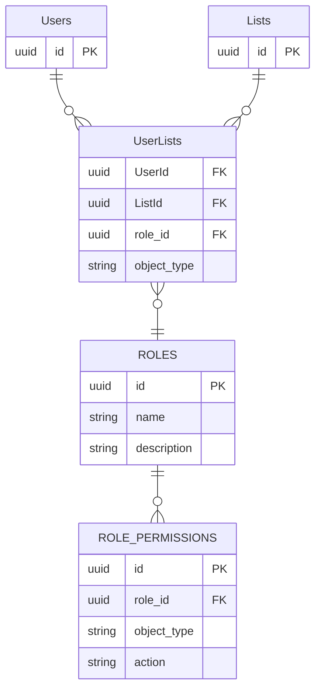

```mermaid
erDiagram
    Users {
        uuid id PK
    }

    Lists {
        uuid id PK
    }

    UserLists {
        uuid UserId FK
        uuid ListId FK
        uuid role_id FK
        string object_type
    }

    ROLES {
        uuid id PK
        string name
        string description
    }

    ROLE_PERMISSIONS {
        uuid id PK
        uuid role_id FK
        string object_type
        string action
    }

    %% Relationships
    Users ||--o{ UserLists : ""
    ROLES ||--o{ ROLE_PERMISSIONS : ""
    UserLists }o--|| ROLES : ""
    Lists ||--o{ UserLists : ""
```